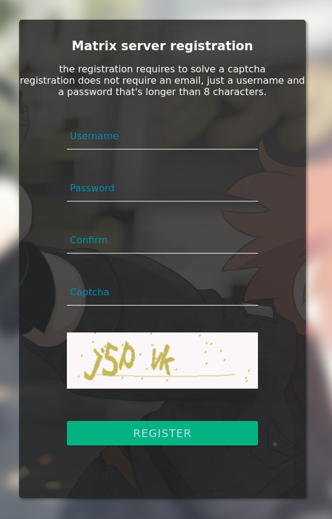

This project is a fork of https://github.com/zeratax/matrix-registration, a project to have a token based registration form for Matrix servers. This fork replace the token mechanism with a self-hosted captcha.


# matrix-registration (with captcha)

A simple python application to have a self-hosted captcha based matrix registration page.

If you like me encountered the situation where you want to let people register to your homeserver, but neither wanted to open up public registration nor use Google recaptcha or email, this project should be the solution.





## setup

This project is compatible with the [matrix-docker-ansible-deploy playbook](https://github.com/spantaleev/matrix-docker-ansible-deploy).

Add the following to your inventory/hosts_vars/matrix.HOMESERVER/vars.yml file:

```
matrix_registration_enabled: true
matrix_registration_admin_secret: "null" # not needed by this fork but required by the playbook
matrix_registration_docker_image: "{{ matrix_registration_docker_image_name_prefix }}anonfloppa/matrix-registration:{{ matrix_registration_version }}"
matrix_registration_version: "v0.7.2.1"
```

the registration page will be available at https://matrix.HOMESERVER/matrix-registration/register


Note: the page use https://HOMESERVER/background.jpg as its background image.
